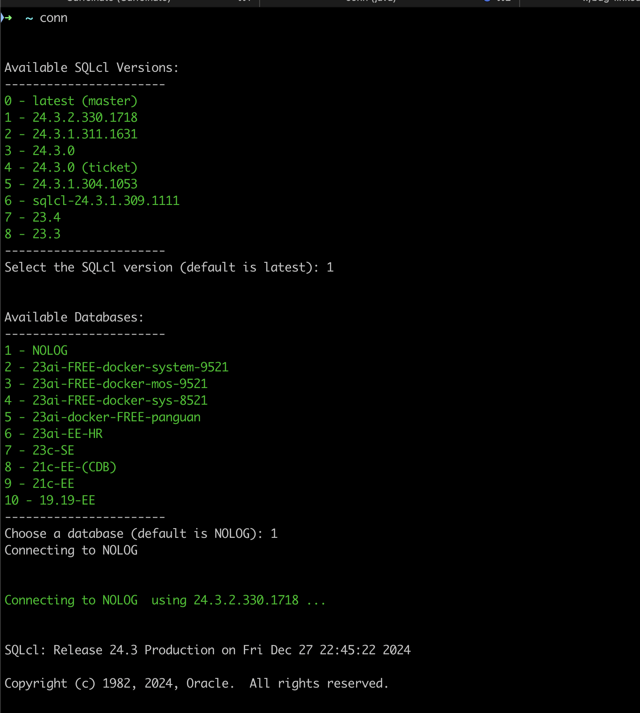
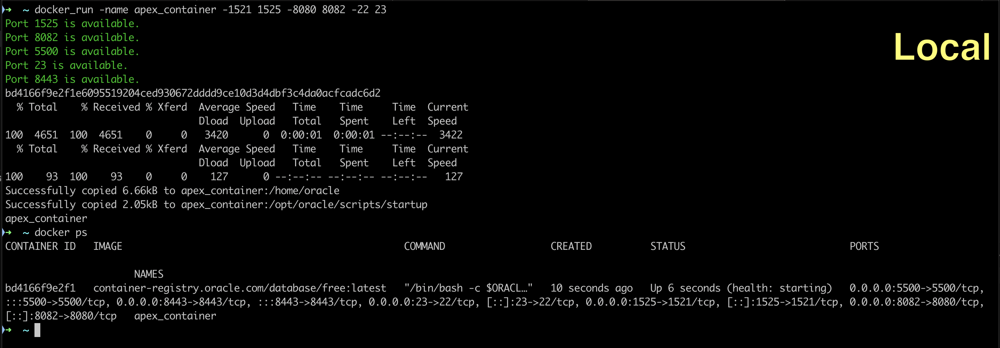

# Installation

Once you've cloned the repo to your local machine, make sure that `zshrc/aliases.sh` is sourced in your default startup file (`.zshrc` for Mac users).

example:
> source $HOME/Workspace/toolbox/zshrc/aliases.sh

# SQLcl

The `conn` alias used to access the `conn.sh` script.

Example:



This is how your `sqlcl/secrets.sh` file should look:

```

#!/bin/bash 


declare DATABASES=(
    "CONN_NAME | CONN_STRING"
) 

declare SQLCL_VERSIONS=(
    "SQLcl Version | Binary Path"
)

```

# Docker

The `run_apex.sh` script is used to create an APEX container.

You can run it using the `run_apex` alias from your terminal.

Usage:

>run_apex -name <container-name> -1521 <db-port-mappin> -8080 <apex-port-mapping> -5500 <5500-mapping> -22 <22-mapping> -8443 <8443-mapping>

Example:


